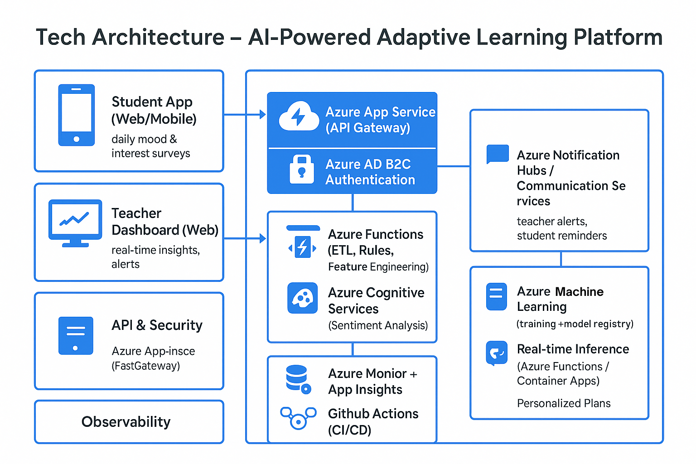

# New-Era-Adaptive-Learning-Companion
The New Era Personalized Learning Platform is an innovative educational solution that tracks students’ mood and engagement in real-time to provide personalized study plans and adaptive learning recommendations. Teachers gain insights through dashboards to monitor emotional well-being and academic readiness, enabling timely interventions.  
## 🚀 Project Overview
The **New Era Personalized Learning Platform** is an innovative educational solution that tracks students’ **mood and engagement** in real-time to provide **personalized study plans and adaptive learning recommendations**. Teachers gain insights through dashboards to monitor emotional well-being and academic readiness, enabling **timely interventions**.  

**Cloud Deployment:** Hosted on **Microsoft Azure** for secure, scalable, and reliable access.

---

## ✨ Features
- ✅ Daily mood and engagement tracking  
- ✅ AI/ML-based emotional and engagement analysis  
- ✅ Personalized learning routines and recommendations  
- ✅ Real-time teacher dashboards with actionable insights  
- ✅ Alerts for low motivation or stress  
- ✅ Scalable cloud deployment using Azure  

---

## ⚠️ Problem Statement
Traditional education systems often **ignore students’ emotional and psychological readiness**, leading to disengagement, stress, and inconsistent academic performance. Teachers have limited visibility into student moods, making it challenging to **personalize learning or provide timely support**.

---

## 💡 Proposed Solution
1. Students complete **daily mood surveys** via web or mobile apps  
2. Data is analyzed using **AI/ML algorithms** for patterns and trends  
3. Teachers view insights on a **real-time dashboard**  
4. The system generates **personalized study plans and adaptive recommendations**  
5. Alerts are sent to teachers for early intervention  
6. Hosted on **Azure App Service** for scalability and security  

---

### 🏛 Architecture & Methodology

**Workflow Overview:** Student → Survey → Data Analysis → Dashboard → Personalized Plan → Feedback Loop → Hosted on Azure

flowchart 
    **A[Student App]** --> **B[Data Collection: Mood Survey]**
    B -->**C[Data Storage: SQL Database and Data Lake]**
    C -->**D[AI/ML Analysis: Mood Patterns and Engagement Trends]**
    D --> **E[Teacher Dashboard: Insights and Alerts]**
    E --> **F[Personalized Learning Engine: Study Plans and Recommendations]**
    F --> **B**
    C --> **G[Azure Cloud Deployment]**

**🛠 Tech Stack**
Layer	Technology
Frontend	React.js, HTML5, CSS3, JavaScript, Bootstrap, Tailwind CSS, React Native
Backend	Python (Flask/Django), Node.js (Express.js)
Database	SQL Database, Data Lake
AI/ML & Analytics	TensorFlow, Keras, Scikit-learn, Pandas, NumPy, Sentiment Analysis
Cloud Deployment	Microsoft Azure App Service, Azure Active Directory
Visualization	Power BI, Matplotlib, Seaborn
Version Control	Git, GitHub

**👥 User Roles & Permissions**
Role	Permissions
Student	Submit surveys, view study plans, access resources
Teacher	View dashboards, monitor trends, suggest interventions
Administrator	Manage users, system settings, deployment, security
Parent/Guardian	View child’s trends (read-only), receive alerts

**🔗 Data Integrations**
SSO / Identity Provider: Azure Active Directory

External Educational Content Providers: e-learning platforms

Push Notifications: Alerts and reminders for teachers/students

Analytics & Monitoring: Real-time performance tracking

**📊 Expected Scale**
Supports thousands of daily student submissions

Scalable architecture for peak usage without performance issues

**🔒 Compliance & Security**
GDPR: Consent-based data collection, deletion on request

FERPA: Protects student educational records

HIPAA: Secures sensitive emotional health information

Data encryption, role-based access control, secure Azure deployment

**⚙️ Installation & Setup**
bash
Copy code
# Clone repository
git clone https://github.com/YourUsername/NewEraPersonalizedLearningPlatform.git
cd NewEraPersonalizedLearningPlatform

# Backend setup
pip install -r requirements.txt

# Frontend setup
cd frontend
npm install
npm start

# Database configuration
# Configure SQL Database & Data Lake connection strings in backend

# Deployment
# Deploy backend & frontend on Azure App Service
**📝 Usage**

Students log in to submit daily mood surveys

Teachers monitor dashboards for trends and alerts

Personalized study plans and content are generated automatically

System sends alerts for low engagement or stress

**🔮 Future Enhancements**

Integration with additional third-party educational platforms

Push notifications for personalized reminders

Predictive analytics for long-term student performance

Gamification elements to increase engagement and motivation
